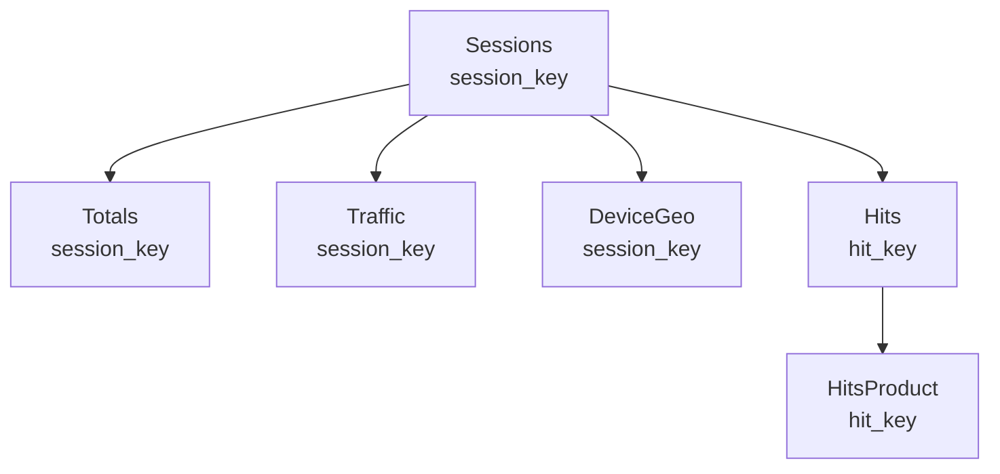

# 📊 BigQuery → Azure SQL 데이터 파이프라인

Google Analytics의 웹사이트 트래픽 데이터를 BigQuery를 통해 조회한 후, 가공하여 Azure SQL 데이터베이스에 저장하는 자동화 데이터 파이프라인입니다.

## 🎯 프로젝트 목표

이 프로젝트는 Google Analytics에서 수집된 방대한 고객 행동 데이터를 주기적으로 가져와, 데이터 분석가나 마케터가 활용하기 좋은 형태로 SQL 데이터베이스에 정리해주는 역할을 합니다. 이를 통해 수동으로 데이터를 추출하고 변환하는 과정을 자동화하여 업무 효율을 높이고, 데이터 기반의 빠른 의사결정을 돕습니다.

## ⚙️ 동작 방식

데이터는 아래와 같은 순서로 처리됩니다.

```mermaid
graph TD;
    A[🌐 Google Analytics 데이터] --> B[🔍 Google BigQuery];
    B --> C{🤖 Azure Function<br/>(파이썬 코드 실행)};
    C --> D[⚙️ 데이터 추출 및 가공];
    D --> E[🗄️ Azure SQL 데이터베이스];
```

1. **데이터 조회:** Azure Function이 정해진 시간에 자동으로 실행되어, BigQuery에 저장된 Google Analytics 데이터를 조회합니다.
2. **데이터 가공:** 조회된 원본 데이터를 그대로 사용하지 않고, 분석에 용이하도록 미리 정의된 규칙에 따라 새로운 컬럼을 추가하거나(예: `primary_key`), 형식을 변환합니다(예: 숫자 코드를 '클릭', '구매' 등의 텍스트로 변경).
3. **데이터 저장:** 가공이 완료된 데이터를 6개의 정제된 테이블(`Sessions`, `Totals`, `Traffic`, `DeviceGeo`, `Hits`, `HitsProduct`)로 나누어 Azure SQL 데이터베이스에 최종 저장합니다.

## 🛠️ 주요 기술 및 구성 요소

### 데이터 소스
- **Google BigQuery**: Google Analytics 데이터가 저장된 데이터 웨어하우스
- **샘플 데이터셋**: `bigquery-public-data.google_analytics_sample`

### 처리 환경
- **Azure Functions**: 서버리스 컴퓨팅 서비스 (Python 3.9)
- **HTTP 트리거**: 수동 실행 또는 웹훅을 통한 자동화 가능

### 데이터베이스
- **Azure SQL Database**: 관계형 데이터베이스로 정제된 데이터 저장
- **ga_data 스키마**: 모든 테이블이 이 스키마 아래 구성됨

### 주요 라이브러리
- **google-cloud-bigquery**: BigQuery 데이터 접근
- **pyodbc**: SQL Server 연결
- **azure-identity**: Azure 인증

## 📁 프로젝트 구조 및 주요 파일 설명

```
secondprojectFunction/
├── storeToSQL/                # Azure Function의 핵심 로직이 담긴 디렉토리
│   ├── __init__.py            # 🚀 Azure Function의 시작점 (main 함수)
│   ├── function.json          # 함수 설정 파일 (HTTP 트리거 정의)
│   ├── clients.py             # BigQuery, SQL DB 연결 관리 클래스
│   ├── config.py              # 환경 변수 및 설정 관리
│   ├── queries.py             # BigQuery에 보낼 SQL 쿼리문 정의
│   ├── data_processors.py     # 데이터를 가공하고 테이블별로 나누는 로직
│   ├── models.py              # 데이터 모델 클래스 (dataclass 기반)
│   ├── utils.py               # 유틸리티 함수 (로깅, 에러 처리 등)
│   ├── time_utils.py          # 시간 관련 유틸리티 함수
│   └── sql/
│       ├── create_tables.py   # 테이블 생성 스크립트 실행 모듈
│       └── schema.sql         # 데이터베이스 테이블 구조 정의서
├── requirements.txt           # 필요한 파이썬 라이브러리 목록
├── host.json                  # Azure Function 호스트 설정
├── troubleshooting_log.txt    # 문제 해결 기록용 파일
└── README.md                  # 📖 프로젝트 설명서 (현재 파일)
```

### 주요 파일 상세 설명

#### 1. `__init__.py`
Azure Function의 진입점으로, HTTP 요청을 받아 데이터 처리 파이프라인을 실행합니다. 에러 처리와 로깅을 담당합니다.

#### 2. `clients.py`
BigQuery와 Azure SQL Database에 연결하는 클라이언트를 관리합니다. 연결 풀링과 배치 처리를 통해 성능을 최적화합니다.

#### 3. `config.py`
모든 환경 변수와 설정 값을 중앙에서 관리합니다. 개발/운영 환경에 따라 다른 설정을 적용할 수 있습니다.

#### 4. `queries.py`
BigQuery에 보낼 SQL 쿼리를 정의합니다. Google Analytics 데이터를 가져오는 복잡한 쿼리가 포함되어 있습니다.

#### 5. `data_processors.py`
데이터 처리의 핵심 로직이 담긴 파일로, 원시 데이터를 가공하여 6개의 테이블로 분류합니다.

#### 6. `schema.sql`
Azure SQL Database에 생성할 테이블 구조를 정의합니다. 각 테이블의 열, 제약조건, 인덱스 등을 포함합니다.

## 📊 데이터 모델

이 프로젝트는 Google Analytics 데이터를 다음 6개의 테이블로 구조화합니다:

| 테이블 이름 | 설명 | 주요 필드 |
|------------|------|----------|
| **Sessions** | 사용자 세션 정보 | session_key, primary_key, visitorId, visitStartTime, date |
| **Totals** | 세션 집계 데이터 | session_key, hits, pageviews, timeOnSite, bounces |
| **Traffic** | 트래픽 소스 정보 | session_key, source, medium, campaign, referralPath |
| **DeviceGeo** | 디바이스 및 지역 정보 | session_key, browser, operatingSystem, country, city |
| **Hits** | 페이지 조회 및 이벤트 | hit_key, session_key, hitId, time, pagePath, eventCategory |
| **HitsProduct** | 제품 조회 및 구매 정보 | product_hit_key, hit_key, productId, v2ProductName, productPrice |

### 테이블 구조 상세

#### 1. Sessions 테이블
사용자 세션의 기본 정보를 저장합니다.

| 칼럼명 | 데이터 타입 | 설명 |
|--------|------------|------|
| session_key | VARCHAR(255) | 세션 고유 식별자 (fullVisitorId-visitId 형식) |
| primary_key | VARCHAR(255) | 이전 버전 호환용 키 (날짜-일련번호 형식) |
| visitorId | VARCHAR(255) | 방문자 ID |
| visitNumber | INT | 방문자의 방문 횟수 |
| visitId | INT | 방문 ID |
| visitStartTime | INT | 방문 시작 시간 (UNIX 타임스탬프) |
| date | DATE | 방문 날짜 |
| fullVisitorId | VARCHAR(255) | Google Analytics의 방문자 ID |
| channelGrouping | VARCHAR(255) | 채널 그룹 (Organic Search, Direct 등) |
| socialEngagementType | VARCHAR(255) | 소셜 참여 유형 |

#### 2. Totals 테이블
세션별 집계 데이터를 저장합니다.

| 칼럼명 | 데이터 타입 | 설명 |
|--------|------------|------|
| session_key | VARCHAR(255) | 세션 고유 식별자 (Sessions 테이블과 연결) |
| primary_key | VARCHAR(255) | 이전 버전 호환용 키 |
| visitorId | VARCHAR(255) | 방문자 ID |
| visits | INT | 방문 수 |
| hits | INT | 히트 수 (페이지뷰, 이벤트 등) |
| pageviews | INT | 페이지뷰 수 |
| timeOnSite | INT | 사이트 체류 시간 (초) |
| bounces | INT | 이탈 여부 (1=이탈, 0=비이탈) |
| transactions | INT | 트랜잭션 수 |
| transactionRevenue | INTEGER | 트랜잭션 수익 |
| newVisits | INT | 신규 방문 여부 (1=신규, 0=재방문) |
| totalTransactionRevenue | INTEGER | 총 트랜잭션 수익 |
| sessionQualityDim | INT | 세션 품질 점수 (1-100) |

#### 3. Traffic 테이블
트래픽 소스 정보를 저장합니다.

| 칼럼명 | 데이터 타입 | 설명 |
|--------|------------|------|
| session_key | VARCHAR(255) | 세션 고유 식별자 (Sessions 테이블과 연결) |
| primary_key | VARCHAR(255) | 이전 버전 호환용 키 |
| visitorId | VARCHAR(255) | 방문자 ID |
| referralPath | NVARCHAR(MAX) | 참조 경로 |
| campaign | NVARCHAR(255) | 캠페인 이름 |
| source | NVARCHAR(255) | 트래픽 소스 (google, facebook 등) |
| medium | NVARCHAR(255) | 트래픽 매체 (organic, cpc 등) |
| keyword | NVARCHAR(255) | 검색 키워드 |
| adContent | NVARCHAR(MAX) | 광고 콘텐츠 |
| adwordsPage | INT | AdWords 페이지 |
| adwordsSlot | VARCHAR(255) | AdWords 슬롯 |
| gclId | VARCHAR(255) | Google Click ID |
| adNetworkType | VARCHAR(255) | 광고 네트워크 유형 |
| isVideoAd | BIT | 비디오 광고 여부 |
| isTrueDirect | BIT | 직접 방문 여부 |

#### 4. DeviceGeo 테이블
디바이스 및 지리적 정보를 저장합니다.

| 칼럼명 | 데이터 타입 | 설명 |
|--------|------------|------|
| session_key | VARCHAR(255) | 세션 고유 식별자 (Sessions 테이블과 연결) |
| primary_key | VARCHAR(255) | 이전 버전 호환용 키 |
| visitorId | VARCHAR(255) | 방문자 ID |
| browser | VARCHAR(255) | 브라우저 (Chrome, Safari 등) |
| operatingSystem | VARCHAR(255) | 운영체제 (Windows, iOS 등) |
| isMobile | BIT | 모바일 기기 여부 |
| javaEnabled | BIT | Java 활성화 여부 |
| deviceCategory | VARCHAR(255) | 기기 카테고리 (desktop, mobile, tablet) |
| continent | VARCHAR(255) | 대륙 |
| subContinent | VARCHAR(255) | 하위 대륙 |
| country | VARCHAR(255) | 국가 |
| region | VARCHAR(255) | 지역 |
| metro | VARCHAR(255) | 대도시권 |
| city | VARCHAR(255) | 도시 |
| networkDomain | VARCHAR(255) | 네트워크 도메인 |

#### 5. Hits 테이블
페이지 조회, 이벤트 등의 히트 정보를 저장합니다.

| 칼럼명 | 데이터 타입 | 설명 |
|--------|------------|------|
| hit_key | VARCHAR(255) | 히트 고유 식별자 (fullVisitorId-visitId-hitNumber 형식) |
| session_key | VARCHAR(255) | 세션 고유 식별자 (Sessions 테이블과 연결) |
| hitId | VARCHAR(255) | 이전 버전 호환용 히트 ID (UUID) |
| primary_key | VARCHAR(255) | 이전 버전 호환용 세션 키 |
| visitorId | VARCHAR(255) | 방문자 ID |
| hitNumber | INT | 히트 번호 (세션 내 순서) |
| time | INT | 히트 시간 (세션 시작부터의 밀리초) |
| hour | INT | 히트 발생 시간 (0-23) |
| minute | INT | 히트 발생 분 (0-59) |
| isInteraction | BIT | 상호작용 여부 |
| isEntrance | BIT | 입구 페이지 여부 |
| isExit | BIT | 출구 페이지 여부 |
| pagePath | NVARCHAR(MAX) | 페이지 경로 (URL) |
| hostname | NVARCHAR(255) | 호스트명 |
| pageTitle | NVARCHAR(MAX) | 페이지 제목 |
| searchKeyword | NVARCHAR(255) | 검색 키워드 |
| transactionId | VARCHAR(255) | 트랜잭션 ID |
| screenName | VARCHAR(255) | 화면 이름 (모바일 앱) |
| landingScreenName | VARCHAR(255) | 랜딩 화면 이름 |
| exitScreenName | VARCHAR(255) | 종료 화면 이름 |
| screenDepth | INT | 화면 깊이 |
| eventCategory | VARCHAR(255) | 이벤트 카테고리 |
| eventAction | VARCHAR(255) | 이벤트 액션 |
| eventLabel | NVARCHAR(MAX) | 이벤트 라벨 |
| actionType | VARCHAR(50) | 액션 유형 (클릭, 구매 등) |
| hitType | VARCHAR(50) | 히트 유형 (PAGE, EVENT 등) |
| socialNetwork | VARCHAR(255) | 소셜 네트워크 |
| hasSocialSourceReferral | BIT | 소셜 소스 참조 여부 |
| contentGroup1 | VARCHAR(255) | 콘텐츠 그룹 1 |
| contentGroup2 | VARCHAR(255) | 콘텐츠 그룹 2 |
| contentGroup3 | VARCHAR(255) | 콘텐츠 그룹 3 |
| previousContentGroup1 | VARCHAR(255) | 이전 콘텐츠 그룹 1 |
| previousContentGroup2 | VARCHAR(255) | 이전 콘텐츠 그룹 2 |
| previousContentGroup3 | VARCHAR(255) | 이전 콘텐츠 그룹 3 |
| contentGroupUniqueViews1 | INT | 콘텐츠 그룹 1 고유 조회수 |
| contentGroupUniqueViews2 | INT | 콘텐츠 그룹 2 고유 조회수 |
| contentGroupUniqueViews3 | INT | 콘텐츠 그룹 3 고유 조회수 |
| product_productQuantity | INT | 제품 수량 |
| dataSource | VARCHAR(255) | 데이터 소스 |

#### 6. HitsProduct 테이블
제품 조회 및 구매 정보를 저장합니다.

| 칼럼명 | 데이터 타입 | 설명 |
|--------|------------|------|
| product_hit_key | VARCHAR(255) | 상품 히트 고유 식별자 (fullVisitorId-visitId-hitNumber-productSKU 형식) |
| hit_key | VARCHAR(255) | 히트 고유 식별자 (Hits 테이블과 연결) |
| productId | VARCHAR(255) | 이전 버전 호환용 제품 ID (UUID) |
| hitId | VARCHAR(255) | 이전 버전 호환용 히트 ID |
| visitorId | VARCHAR(255) | 방문자 ID |
| hitNumber | INT | 히트 번호 |
| v2ProductName | NVARCHAR(255) | 제품 이름 |
| v2ProductCategory | NVARCHAR(255) | 제품 카테고리 |
| productBrand | NVARCHAR(255) | 제품 브랜드 |
| productPrice | INTEGER | 제품 가격 |
| productRevenue | INTEGER | 제품 수익 |
| localProductPrice | INTEGER | 현지 통화 제품 가격 |
| isImpression | BIT | 제품 노출 여부 |
| isClick | BIT | 제품 클릭 여부 |
| productListName | NVARCHAR(255) | 제품 목록 이름 |
| productListPosition | INT | 제품 목록 내 위치 |
| productSKU | VARCHAR(255) | 제품 SKU (재고 관리 단위) |

### 테이블 간 관계

각 테이블은 새로 설계된 키 체계를 통해 명확하게 연결됩니다:



- **세션 레벨 테이블**: Sessions, Totals, Traffic, DeviceGeo 테이블은 모두 `session_key`를 통해 연결됩니다. 이 키는 `fullVisitorId-visitId` 형식으로 세션을 고유하게 식별합니다.

- **히트 레벨 테이블**: Hits 테이블은 `session_key`를 통해 Sessions 테이블과 연결되고, `hit_key`를 통해 HitsProduct 테이블과 연결됩니다. `hit_key`는 `fullVisitorId-visitId-hitNumber` 형식으로 히트를 고유하게 식별합니다.

- **상품 레벨 테이블**: HitsProduct 테이블은 `hit_key`를 통해 Hits 테이블과 연결되고, `product_hit_key`를 통해 상품을 고유하게 식별합니다. `product_hit_key`는 `fullVisitorId-visitId-hitNumber-productSKU` 형식입니다.

## 🔗 Power BI 연동 가이드

이 프로젝트는 Power BI와의 원활한 연동을 위해 특별히 설계되었습니다. 다음은 Power BI에서 데이터 모델을 구성하는 방법입니다.

### 1. Power BI에서 데이터 가져오기

1. Power BI Desktop을 엽니다.
2. '데이터 가져오기' > 'SQL Server'를 선택합니다.
3. 서버 이름과 데이터베이스 이름을 입력합니다.
4. '직접 쿼리' 또는 '가져오기' 중 원하는 방식을 선택합니다.
5. 'ga_data' 스키마의 모든 테이블을 선택합니다:
   - Sessions
   - Totals
   - Traffic
   - DeviceGeo
   - Hits
   - HitsProduct

### 2. 테이블 간 관계 설정

Power BI의 '모델' 뷰에서 다음과 같이 테이블 간 관계를 설정합니다:

1. **세션 레벨 관계**:
   - Sessions 테이블의 `session_key`를 Totals 테이블의 `session_key`로 연결합니다.
   - Sessions 테이블의 `session_key`를 Traffic 테이블의 `session_key`로 연결합니다.
   - Sessions 테이블의 `session_key`를 DeviceGeo 테이블의 `session_key`로 연결합니다.
   - Sessions 테이블의 `session_key`를 Hits 테이블의 `session_key`로 연결합니다.

2. **히트 레벨 관계**:
   - Hits 테이블의 `hit_key`를 HitsProduct 테이블의 `hit_key`로 연결합니다.

3. **관계 속성 설정**:
   - 모든 관계에서 '교차 필터 방향'을 '단일'로 설정합니다.
   - 세션 레벨 테이블 간 관계는 '1:1'로 설정합니다.
   - Sessions와 Hits 간 관계는 '1:다'로 설정합니다.
   - Hits와 HitsProduct 간 관계는 '1:다'로 설정합니다.

### 3. 데이터 모델 최적화

1. **계층 구조 생성**:
   - DeviceGeo 테이블에서 지역 계층 구조 생성: 대륙 > 하위 대륙 > 국가 > 지역 > 도시
   - HitsProduct 테이블에서 제품 계층 구조 생성: 카테고리 > 브랜드 > 제품명

2. **측정값 생성**:
   - 방문자 수: `DISTINCTCOUNT(Sessions[fullVisitorId])`
   - 세션 수: `COUNTROWS(Sessions)`
   - 페이지뷰 수: `SUM(Totals[pageviews])`
   - 평균 세션 시간: `AVERAGE(Totals[timeOnSite])`
   - 이탈률: `DIVIDE(COUNTROWS(FILTER(Totals, Totals[bounces] = 1)), COUNTROWS(Totals))`

3. **계산 열 추가**:
   - 세션 날짜(형식 변환): `FORMAT(Sessions[date], "yyyy-MM-dd")`
   - 방문 유형: `IF(Totals[newVisits] = 1, "신규 방문", "재방문")`

### 4. 대시보드 구성 예시

1. **개요 페이지**:
   - 방문자 수, 세션 수, 페이지뷰 수, 평균 세션 시간, 이탈률을 카드 형태로 표시
   - 일별/주별/월별 트렌드를 선 그래프로 표시
   - 채널별 세션 분포를 도넛 차트로 표시

2. **지역 분석 페이지**:
   - 국가별 방문자 분포를 지도로 표시
   - 상위 10개 도시를 막대 그래프로 표시
   - 디바이스 유형별 세션 분포를 파이 차트로 표시

3. **콘텐츠 분석 페이지**:
   - 상위 페이지를 테이블로 표시
   - 콘텐츠 그룹별 페이지뷰를 막대 그래프로 표시
   - 입구/출구 페이지 분석을 테이블로 표시

4. **전환 분석 페이지**:
   - 전환 단계별 이탈률을 깔때기 차트로 표시
   - 제품별 매출을 테이블로 표시
   - 채널별 전환율을 막대 그래프로 표시

이렇게 설정된 Power BI 데이터 모델은 Google Analytics 데이터를 다양한 각도에서 분석할 수 있는 강력한 도구가 됩니다.

## 🚀 로컬 환경에서 실행하기

### 1. 사전 요구사항
- Python 3.8 이상
- Azure Functions Core Tools
- Visual Studio Code + Azure Functions 확장
- ODBC Driver 18 for SQL Server

### 2. 저장소 복제
```bash
git clone [repository-url]
cd secondprojectFunction
```

### 3. 가상환경 생성 및 활성화
```bash
# Windows
python -m venv .venv
.venv\Scripts\activate

# Linux/Mac
python3 -m venv .venv
source .venv/bin/activate
```

### 4. 필요한 라이브러리 설치
```bash
pip install -r requirements.txt
```
> **Note:** `pyodbc` 라이브러리는 시스템에 ODBC 드라이버가 필요합니다. 오류 발생 시 'Microsoft ODBC Driver 18 for SQL Server'를 설치하세요.

### 5. 환경 변수 설정
프로젝트 루트에 `local.settings.json` 파일을 생성하고 아래 내용을 채워넣으세요:

```json
{
  "IsEncrypted": false,
  "Values": {
    "AzureWebJobsStorage": "UseDevelopmentStorage=true",
    "FUNCTIONS_WORKER_RUNTIME": "python",
    "GOOGLE_APPLICATION_CREDENTIALS": "path/to/your/service_account_key.json",
    "SQL_SERVER": "your-server-name.database.windows.net",
    "SQL_DATABASE": "your-database-name",
    "SQL_USERNAME": "your-sql-username",
    "SQL_PASSWORD": "your-sql-password"
  }
}
```

### 6. 데이터베이스 테이블 생성
Azure Portal의 쿼리 편집기에서 `storeToSQL/sql/schema.sql` 파일의 내용을 실행하여 필요한 테이블을 생성하세요.

또는 다음 명령어로 자동 생성할 수 있습니다:
```bash
python -m storeToSQL.sql.create_tables
```

### 7. 로컬 서버 실행
```bash
func start
```

### 8. 함수 테스트
브라우저나 Postman에서 다음 URL로 HTTP 요청을 보내 함수를 테스트할 수 있습니다:
```
http://localhost:7071/api/storeToSQL
```

## 🔄 데이터 파이프라인 실행 흐름

1. HTTP 요청이 Azure Function을 트리거합니다.
2. BigQuery 클라이언트가 초기화되고 Google Analytics 데이터를 조회합니다.
3. 조회된 데이터는 행(row) 단위로 처리됩니다.
4. 각 행은 DataProcessor에 의해 6개 테이블에 맞게 변환됩니다.
5. 변환된 데이터는 배치로 Azure SQL Database에 삽입됩니다.
6. 처리 결과 요약이 HTTP 응답으로 반환됩니다.

## 📊 데이터 조회 범위 조정

기본적으로 이 프로젝트는 2017년 8월 1일 데이터의 처음 1,000개 행을 가져오도록 설정되어 있습니다. 조회 범위를 조정하려면 다음과 같이 설정을 변경하세요:

### 1. 날짜 변경

다른 날짜의 데이터를 가져오려면 `config.py` 파일에서 `BQ_DATE_SUFFIX` 값을 변경하세요:

```python
# 예: 2017년 8월 2일 데이터 조회
BQ_DATE_SUFFIX = "20170802"
```

### 2. 데이터 수 변경

한 번에 가져올 데이터 수를 변경하려면 `config.py` 파일에서 `BQ_LIMIT` 값을 조정하세요:

```python
# 예: 2,000개 데이터 조회
BQ_LIMIT = 2000
```

### 3. 시작 위치 조정 (페이지네이션)

특정 위치부터 데이터를 가져오려면 `config.py` 파일에 `BQ_OFFSET` 변수를 추가하고, `queries.py` 파일에 OFFSET 구문을 추가하세요:

1. `config.py` 파일 수정:
```python
# 예: 처음 1,000개를 건너뛰고 1,001번째부터 데이터 조회
BQ_OFFSET = 1000
```

2. `queries.py` 파일에 import 추가:
```python
from .config import BQ_DATE_SUFFIX, BQ_LIMIT, BQ_OFFSET
```

3. 쿼리 마지막에 OFFSET 구문 추가:
```python
WHERE _TABLE_SUFFIX = '{BQ_DATE_SUFFIX}'
OFFSET {BQ_OFFSET}
LIMIT {BQ_LIMIT}
```

이렇게 하면 대용량 데이터를 여러 번에 나누어 처리할 수 있습니다. 예를 들어, 처음 1,000개 행을 처리한 후 `BQ_OFFSET = 1000`으로 설정하여 다음 1,000개 행을 처리할 수 있습니다.

### 4. 데이터 조회 예시

다음은 몇 가지 일반적인 시나리오에 대한 설정 예시입니다:

- **특정 날짜의 처음 500개 행 조회**:
  ```python
  BQ_DATE_SUFFIX = "20170801"
  BQ_LIMIT = 500
  ```

- **특정 날짜의 501번째부터 1,000번째까지 조회**:
  ```python
  BQ_DATE_SUFFIX = "20170801"
  BQ_OFFSET = 500
  BQ_LIMIT = 500
  ```

- **여러 날짜의 데이터 처리**:
  날짜를 반복문으로 변경하며 함수를 여러 번 호출하는 방식으로 구현할 수 있습니다.

## 🔐 보안 고려사항

- **서비스 계정 키:** Google Cloud 서비스 계정 키는 절대 Git에 커밋하지 마세요. 항상 `.gitignore`에 추가하고 안전하게 관리하세요.
- **데이터베이스 자격 증명:** 연결 정보는 환경 변수나 Azure Key Vault를 통해 관리하세요.
- **최소 권한 원칙:** 서비스 계정과 데이터베이스 사용자에게는 필요한 최소한의 권한만 부여하세요.

## 🔧 문제 해결

문제가 발생하면 `troubleshooting_log.txt` 파일을 참조하세요. 이 파일에는 이전에 발생한 문제와 해결 방법이 기록되어 있습니다.

일반적인 문제:
- ODBC 드라이버 관련 오류: 올바른 버전(18)의 드라이버가 설치되어 있는지 확인하세요.
- 테이블 없음 오류: schema.sql이 성공적으로 실행되었는지 확인하세요.
- 인증 오류: 환경 변수가 올바르게 설정되었는지 확인하세요.

## 📈 성능 최적화

- **배치 처리:** 데이터는 BATCH_SIZE(100개) 단위로 배치 삽입됩니다.
- **연결 재사용:** 클라이언트 연결은 초기화 후 재사용됩니다.
- **트랜잭션 관리:** 배치 삽입은 트랜잭션으로 처리되어 일관성을 보장합니다.

## 📄 라이선스

이 프로젝트는 MIT 라이선스를 따릅니다.

## 👥 기여 방법

1. 이슈 등록: 버그나 기능 요청은 이슈 트래커에 등록해주세요.
2. 풀 리퀘스트: 코드 개선이나 새 기능 추가는 풀 리퀘스트를 통해 제안해주세요.
3. 코드 스타일: PEP 8 가이드라인을 따라주세요.

## 📚 참고 자료

- [Azure Functions Python 개발자 가이드](https://docs.microsoft.com/ko-kr/azure/azure-functions/functions-reference-python)
- [Google BigQuery 문서](https://cloud.google.com/bigquery/docs)
- [Azure SQL Database 문서](https://docs.microsoft.com/ko-kr/azure/azure-sql/database/)

## 💾 데이터베이스 시스템 간 데이터 타입 매핑

이 프로젝트는 Google BigQuery에서 Azure SQL Database로 데이터를 이동합니다. 두 시스템은 서로 다른 데이터 타입을 사용하므로, 다음과 같은 매핑 규칙을 적용했습니다:

### 데이터 타입 매핑 테이블

| BigQuery 데이터 타입 | Azure SQL Database 데이터 타입 | 설명 |
|---------------------|----------------------------|------|
| STRING | VARCHAR / NVARCHAR | BigQuery의 STRING 타입은 Azure SQL에서 VARCHAR(ASCII용) 또는 NVARCHAR(유니코드용)로 매핑 |
| INTEGER | INT | 4바이트 정수형 |
| INT64 | BIGINT | 8바이트 정수형 |
| FLOAT64 | FLOAT | 부동소수점 |
| BOOLEAN | BIT | 불리언 값 (true/false) |
| TIMESTAMP | DATETIME2 | 날짜 및 시간 |
| DATE | DATE | 날짜만 포함 |
| BYTES | VARBINARY | 바이너리 데이터 |
| ARRAY | 지원 안 함 | Azure SQL에서는 배열 타입을 직접 지원하지 않음. JSON으로 저장하거나 별도 테이블로 정규화 필요 |
| STRUCT | 지원 안 함 | Azure SQL에서는 구조체 타입을 직접 지원하지 않음. 별도 테이블로 정규화 필요 |

### 중요 사항

- **문자열 데이터**: BigQuery에서는 모든 문자열을 `STRING` 타입으로 저장하지만, Azure SQL Database에서는 다음과 같이 구분해야 합니다:
  - `VARCHAR`: ASCII 문자만 포함된 문자열 (영문, 숫자, 특수문자)
  - `NVARCHAR`: 유니코드 문자가 포함된 문자열 (한글, 일본어, 중국어 등)
  - 길이 제한: VARCHAR(8000), NVARCHAR(4000)이 최대이며, 더 큰 데이터는 VARCHAR(MAX), NVARCHAR(MAX) 사용

- **숫자 데이터**: 정확한 소수점 계산이 필요한 경우 FLOAT 대신 DECIMAL 타입 사용 권장

- **날짜/시간 데이터**: BigQuery의 TIMESTAMP는 Azure SQL의 DATETIME2로 매핑

### 공식 문서 참조

이 매핑은 다음 공식 문서를 기반으로 합니다:

- [Microsoft SQL Server 데이터 타입](https://learn.microsoft.com/en-us/sql/t-sql/data-types/data-types-transact-sql?view=azuresqldb-current) - Azure SQL Database는 SQL Server와 동일한 데이터 타입을 사용합니다.
  - [문자열 데이터 타입 (Character strings)](https://learn.microsoft.com/en-us/sql/t-sql/data-types/data-types-transact-sql?view=azuresqldb-current#character-strings) - VARCHAR, NVARCHAR 등 문자열 데이터 타입 설명
  - [VARCHAR 데이터 타입 상세 설명](https://learn.microsoft.com/en-us/sql/t-sql/data-types/char-and-varchar-transact-sql?view=azuresqldb-current) - ASCII 문자열 저장에 사용
  - [NVARCHAR 데이터 타입 상세 설명](https://learn.microsoft.com/en-us/sql/t-sql/data-types/nchar-and-nvarchar-transact-sql?view=azuresqldb-current) - 유니코드 문자열 저장에 사용
- [Google BigQuery 데이터 타입](https://cloud.google.com/bigquery/docs/reference/standard-sql/data-types)
  - [BigQuery STRING 데이터 타입](https://cloud.google.com/bigquery/docs/reference/standard-sql/data-types#string_type) - BigQuery에서 문자열 저장에 사용

> **참고**: Azure SQL Database에서는 `STRING` 데이터 타입이 지원되지 않습니다. 스키마 정의 시 반드시 `VARCHAR` 또는 `NVARCHAR`를 사용해야 합니다.